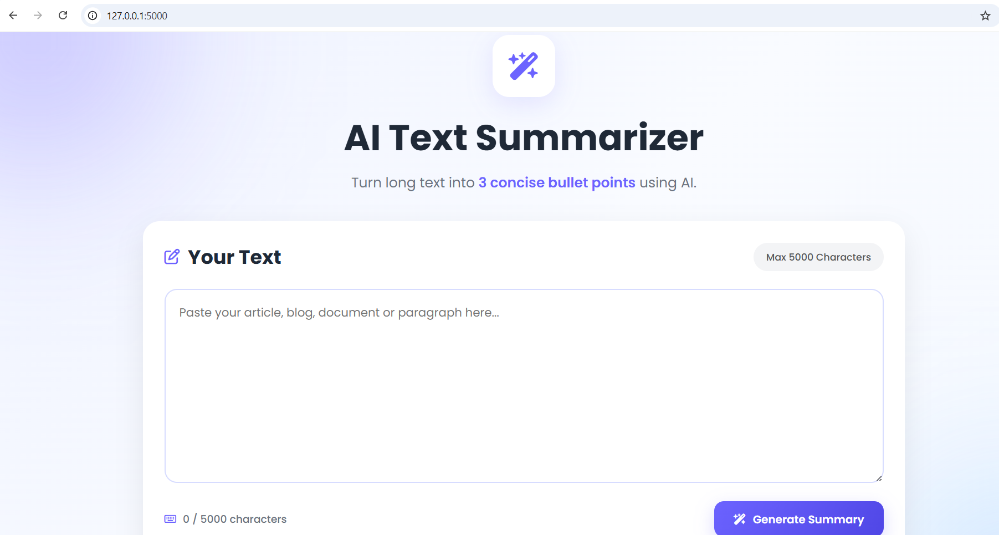
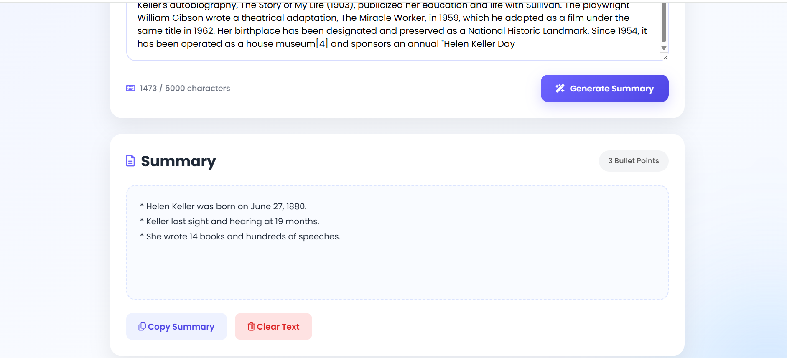

# ✨ AI Text Summarizer

A modern AI-powered text summarization web application built with **Flask** and the **Groq API**. Users can paste long articles, blogs, or documents and instantly receive a concise **3-bullet summary**.

This project was developed as part of an **Engineering Intern Assignment**.

---

## 🚀 Features

- 🤖 AI-powered text summarization using Groq API
- 📝 Generate exactly 3 concise bullet points
- 🎨 Modern and responsive user interface
- 📊 Live character counter (Max 5000 characters)
- ⌨️ Keyboard shortcut (**Ctrl + Enter**) to generate summary
- 📋 One-click copy summary
- 🗑️ Clear input text instantly
- ⚠️ Proper error handling and validation
- 🔒 Secure API key management using `.env`

---

# 📸 Screenshots

## 🏠 Home Page

The application provides a clean and intuitive interface where users can paste text and generate summaries.



---

## 🤖 AI Generated Summary

After clicking **Generate Summary**, the application communicates with the Groq AI model and displays a concise three-point summary.



---

# 🛠 Tech Stack

### Backend

- Python
- Flask

### Frontend

- HTML5
- CSS3
- JavaScript
- Font Awesome
- Google Fonts (Poppins)

### AI

- Groq API
- Llama 3.3 70B Versatile

---

# 📂 Project Structure

```text
AI-TEXT-SUMMARIZER/
│
├── app.py
├── config.py
├── requirements.txt
├── README.md
├── .env.example
├── .gitignore
│
├── screenshots/
│   ├── home.png
│   └── summary.png
│
├── static/
│   ├── style.css
│   ├──  script.js
│
├── templates/
│   └── index.html
│
├── utils/
│   ├── __init__.py
│   └── summarizer.py
│
└── venv/
```

---

# ⚙️ Installation

## 1. Clone the repository

```bash
git clone https://github.com/your-github-username/ai-text-summarizer.git
```

---

## 2. Go to the project folder

```bash
cd ai-text-summarizer
```

---

## 3. Create a virtual environment

Windows

```bash
python -m venv venv
```

Linux / macOS

```bash
python3 -m venv venv
```

---

## 4. Activate the virtual environment

Windows

```bash
venv\Scripts\activate
```

Linux / macOS

```bash
source venv/bin/activate
```

---

## 5. Install dependencies

```bash
pip install -r requirements.txt
```

---

## 6. Create a `.env` file

```env
GROQ_API_KEY=your_groq_api_key_here
```

---

## 7. Run the application

```bash
python app.py
```

Visit:

```text
http://127.0.0.1:5000
```

---

# 💡 How It Works

1. User enters text into the textarea.
2. JavaScript sends the text to the Flask backend using the Fetch API.
3. Flask validates the input.
4. Flask calls the Groq API.
5. Groq generates a concise summary.
6. Flask returns the summary as JSON.
7. JavaScript updates the webpage without reloading.

---

# 🧠 Prompt Engineering

The application uses the following system prompt:

> You are an expert text summarizer. Summarize the provided text into exactly three concise bullet points. Preserve the most important information, avoid repetition, and return only the bullet points.

This prompt ensures:

- Exactly three bullet points
- Consistent formatting
- Concise summaries
- Better AI response quality

---

# ✅ Validation & Error Handling

The application handles:

- Empty input
- Character limit (5000)
- Invalid API responses
- Network errors
- Unexpected server errors
- Missing API key

---

# 🚀 Future Improvements

- Dark Mode
- Multiple AI model selection
- Download summary as PDF
- Summary history
- User authentication
- Multi-language support

---

# 📚 What I Learned

Through this project I gained practical experience with:

- Flask web development
- REST APIs
- Prompt engineering
- Environment variables
- JavaScript Fetch API
- Frontend and backend integration
- Responsive UI design
- Error handling
- Clean project organization

---

# 👨‍💻 Author

Nikhil Mehta

Engineering Intern Assignment